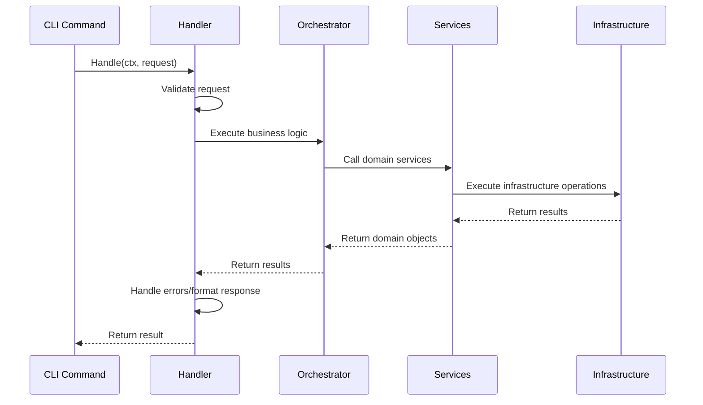

# 3. Padrão Command/Handler

## 🎯 Conceito

O padrão Command/Handler separa a **definição** dos comandos CLI da sua **execução**, promovendo código mais limpo, testável e reutilizável.

## 🏗️ Estrutura do Padrão

### 3.1 Comandos CLI (Definição)

Os comandos ficam responsáveis apenas por:

- Definir flags e parâmetros
- Validar entrada básica
- Delegar execução para handlers

```txt
cmd/create.go - Apenas definição
```

```go
var createClusterCmd = &cobra.Command{
    Use:   "cluster",
    Short: "Cria o cluster Girus",
    Long:  `Cria um cluster Kind com o nome "girus" e implanta todos os componentes necessários.`,
    RunE: func(cmd *cobra.Command, args []string) error {
        // 1. Construir configuração a partir das flags
        config := &handlers.CreateClusterRequest{
            Name:            clusterName,
            ContainerEngine: containerEngine,
            DeployFile:      deployFile,
            Verbose:         verboseMode,
            SkipPortForward: skipPortForward,
            SkipBrowser:     skipBrowser,
        }
        
        // 2. Validar entrada básica
        if err := config.Validate(); err != nil {
            return fmt.Errorf("invalid input: %w", err)
        }
        
        // 3. Delegar para handler
        handler := app.Container.GetCreateClusterHandler()
        return handler.Handle(cmd.Context(), config)
    },
}
```

### 3.2 Handlers (Execução)

Os handlers contêm toda a lógica de execução:

```txt
internal/app/handlers/create_cluster.go
```

```go
type CreateClusterHandler struct {
    orchestrator *services.ClusterOrchestrator
    errorHandler *errors.Handler
    logger       logger.Logger
}

type CreateClusterRequest struct {
    Name            string
    ContainerEngine string
    DeployFile      string
    Verbose         bool
    SkipPortForward bool
    SkipBrowser     bool
}

func (r *CreateClusterRequest) Validate() error {
    if r.Name == "" {
        return errors.New("cluster name is required")
    }
    
    if r.ContainerEngine != "docker" && r.ContainerEngine != "podman" {
        return fmt.Errorf("unsupported container engine: %s", r.ContainerEngine)
    }
    
    return nil
}

func (h *CreateClusterHandler) Handle(ctx context.Context, req *CreateClusterRequest) error {
    h.logger.Info("creating cluster", 
        "name", req.Name, 
        "engine", req.ContainerEngine,
    )
    
    // Converter para domain request
    orchestratorReq := &services.CreateClusterRequest{
        Name:            req.Name,
        ContainerEngine: req.ContainerEngine,
        DeployFiles:     h.getDeployFiles(req.DeployFile),
        SkipAccess:      req.SkipPortForward && req.SkipBrowser,
        Verbose:         req.Verbose,
    }
    
    // Executar através do orchestrator
    if err := h.orchestrator.CreateCluster(ctx, orchestratorReq); err != nil {
        return h.errorHandler.Handle(err)
    }
    
    h.logger.Info("cluster created successfully", "name", req.Name)
    return nil
}

func (h *CreateClusterHandler) getDeployFiles(deployFile string) []string {
    if deployFile != "" {
        return []string{deployFile}
    }
    
    // Usar manifests embutidos como fallback
    return h.getEmbeddedManifests()
}
```

### 3.3 Request/Response Types

```txt
internal/app/handlers/create_lab.go
```

```go
type CreateLabRequest struct {
    Source    LabSource
    FilePath  string
    RepoURL   string
    LabID     string
    Verbose   bool
}

type CreateLabResponse struct {
    Lab       *domain.Lab
    Installed bool
    Message   string
}

func (r *CreateLabRequest) Validate() error {
    switch r.Source {
    case LabSourceFile:
        if r.FilePath == "" {
            return errors.New("file path is required for file source")
        }
    case LabSourceRepo:
        if r.LabID == "" || r.RepoURL == "" {
            return errors.New("lab ID and repo URL are required for repo source")
        }
    default:
        return fmt.Errorf("invalid lab source: %s", r.Source)
    }
    return nil
}
```

## 🧪 Testabilidade dos Handlers

### 3.4 Testes Unitários

```txt
internal/app/handlers/create_cluster_test.go
```

```go
func TestCreateClusterHandler_Handle(t *testing.T) {
    tests := []struct {
        name               string
        request            *CreateClusterRequest
        orchestratorError  error
        expectedError      string
    }{
        {
            name: "successful cluster creation",
            request: &CreateClusterRequest{
                Name:            "test-cluster",
                ContainerEngine: "docker",
                Verbose:         false,
            },
            orchestratorError: nil,
            expectedError:     "",
        },
        {
            name: "cluster already exists",
            request: &CreateClusterRequest{
                Name:            "existing-cluster",
                ContainerEngine: "docker",
            },
            orchestratorError: domain.NewClusterExistsError("existing-cluster"),
            expectedError:     "cluster already exists",
        },
        {
            name: "invalid container engine",
            request: &CreateClusterRequest{
                Name:            "test-cluster",
                ContainerEngine: "invalid",
            },
            expectedError: "unsupported container engine",
        },
    }

    for _, tt := range tests {
        t.Run(tt.name, func(t *testing.T) {
            // Setup mocks
            mockOrchestrator := &services.MockClusterOrchestrator{}
            mockErrorHandler := &errors.MockHandler{}
            mockLogger := &logger.MockLogger{}
            
            handler := &CreateClusterHandler{
                orchestrator: mockOrchestrator,
                errorHandler: mockErrorHandler,
                logger:       mockLogger,
            }
            
            // Configure mocks
            if tt.request.ContainerEngine == "docker" || tt.request.ContainerEngine == "podman" {
                mockOrchestrator.On("CreateCluster", mock.Anything, mock.Anything).
                    Return(tt.orchestratorError)
                
                if tt.orchestratorError != nil {
                    mockErrorHandler.On("Handle", tt.orchestratorError).
                        Return(tt.orchestratorError)
                }
            }
            
            // Execute
            err := handler.Handle(context.Background(), tt.request)
            
            // Assert
            if tt.expectedError == "" {
                assert.NoError(t, err)
            } else {
                assert.Error(t, err)
                assert.Contains(t, err.Error(), tt.expectedError)
            }
            
            mockOrchestrator.AssertExpectations(t)
        })
    }
}
```

## 🏭 Dependency Injection

### 3.5 Container de Dependências

```txt
internal/app/container.go
```

```go
type Container struct {
    config *config.Config
    
    // Services
    clusterSvc      cluster.Service
    labSvc          lab.Service
    prerequisiteSvc infrastructure.Service
    uiSvc           ui.Service
    
    // Orchestrators
    clusterOrchestrator *services.ClusterOrchestrator
    labOrchestrator     *services.LabOrchestrator
    
    // Handlers
    createClusterHandler *handlers.CreateClusterHandler
    createLabHandler     *handlers.CreateLabHandler
}

func NewContainer(config *config.Config) (*Container, error) {
    container := &Container{config: config}
    
    if err := container.initializeServices(); err != nil {
        return nil, fmt.Errorf("failed to initialize services: %w", err)
    }
    
    if err := container.initializeOrchestrators(); err != nil {
        return nil, fmt.Errorf("failed to initialize orchestrators: %w", err)
    }
    
    if err := container.initializeHandlers(); err != nil {
        return nil, fmt.Errorf("failed to initialize handlers: %w", err)
    }
    
    return container, nil
}

func (c *Container) GetCreateClusterHandler() *handlers.CreateClusterHandler {
    return c.createClusterHandler
}

func (c *Container) initializeServices() error {
    // Initialize concrete implementations
    k8sClient, err := k8s.NewClient(c.config.Cluster.KubeConfig)
    if err != nil {
        return fmt.Errorf("failed to create k8s client: %w", err)
    }
    
    c.clusterSvc = cluster.NewKindService(
        exec.NewCommandExecutor(),
        k8sClient,
        config.NewValidator(),
        logger.NewStructuredLogger(c.config.LogLevel),
    )
    
    // ... initialize other services
    
    return nil
}
```

## 🔄 Fluxo de Execução

### 3.6 Sequência Completa



## 📊 Benefícios do Padrão

| Aspecto | Antes | Depois |
|---------|-------|---------|
| **Testabilidade** | Impossível (dependências hardcoded) | Excelente (mocks facilmente) |
| **Reutilização** | Baixa (lógica na CLI) | Alta (handlers independentes) |
| **Separação** | Misturada | Clara (comando vs execução) |
| **Manutenção** | Difícil (código acoplado) | Fácil (responsabilidades claras) |

## 🎯 Exemplo de Refatoração

### Antes (Problemático)

```go
var createClusterCmd = &cobra.Command{
    Use: "cluster",
    Run: func(cmd *cobra.Command, args []string) {
        // 500+ linhas de lógica misturada
        fmt.Println("Creating cluster...")
        containerEngineCmd := exec.Command(containerEngine, "--version")
        if err := containerEngineCmd.Run(); err != nil {
            fmt.Printf("Error: %v\n", err)
            os.Exit(1)
        }
        // ... mais 400 linhas
    },
}
```

### Depois (Limpo)

```go
var createClusterCmd = &cobra.Command{
    Use: "cluster",
    RunE: func(cmd *cobra.Command, args []string) error {
        config := buildConfigFromFlags()
        handler := app.Container.GetCreateClusterHandler()
        return handler.Handle(cmd.Context(), config)
    },
}
```

## 🔄 Próxima Etapa

[Interfaces e Contratos](./04-interfaces-contratos.md) - Definindo contratos claros entre componentes.
