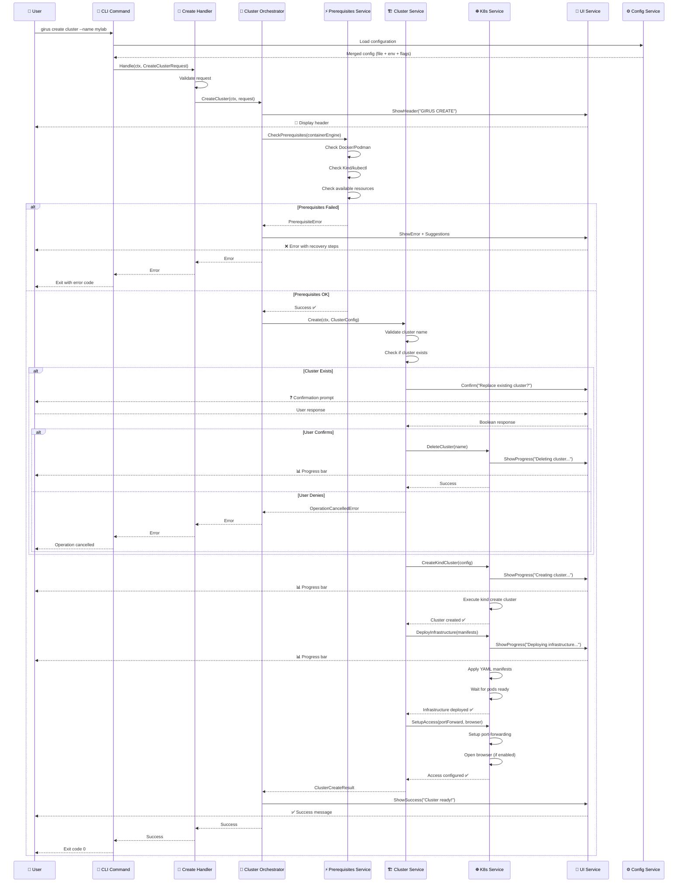
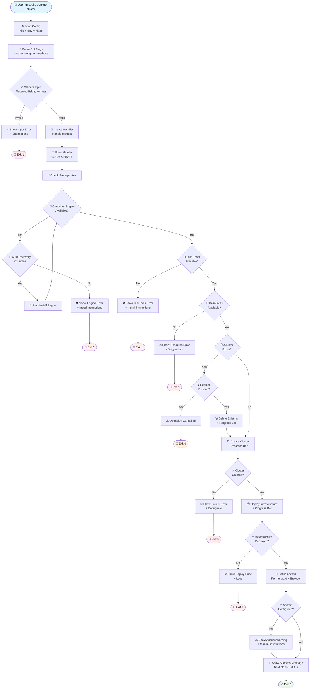
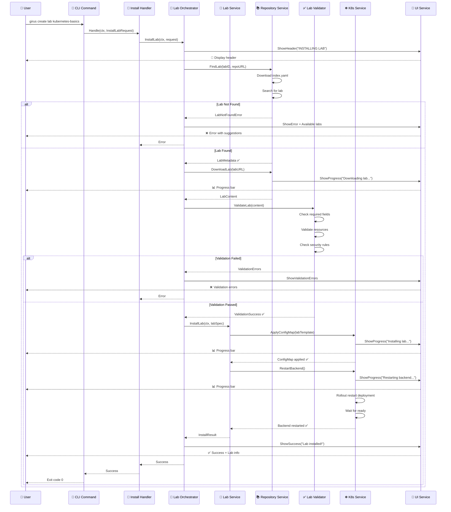
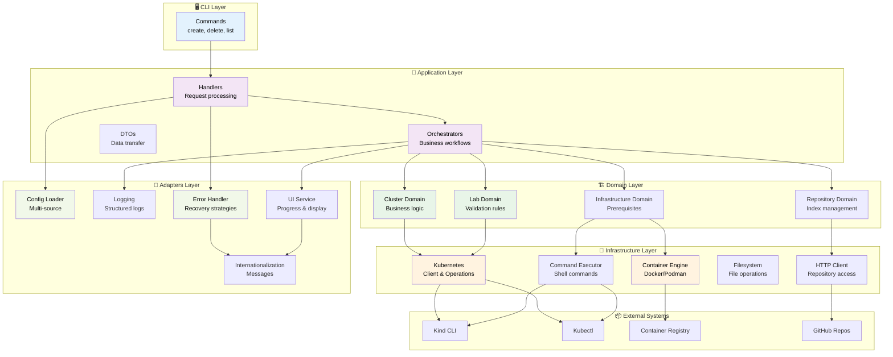
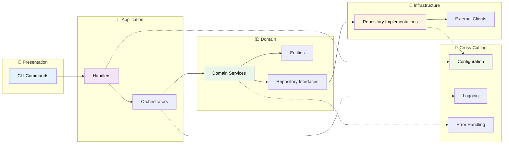
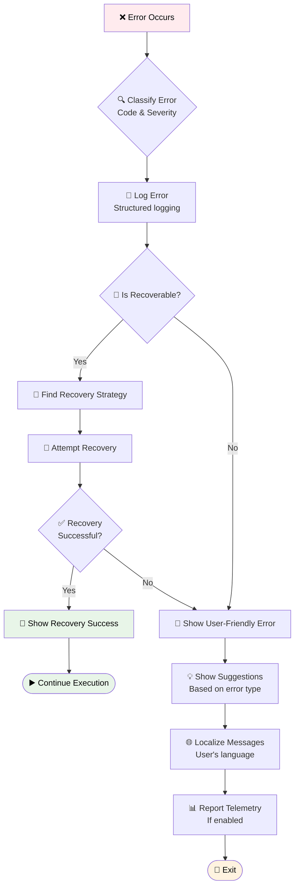
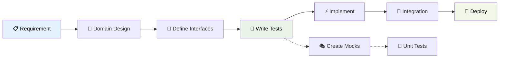

# 8. Fluxograma do Novo Funcionamento

## 🎯 Objetivo

Visualizar o fluxo de execução da nova arquitetura através de diagramas que mostram como os diferentes componentes interagem para executar operações como criação de cluster e instalação de laboratórios.

## 🔄 Fluxo Principal: Create Cluster

### 8.1 Diagrama de Sequência - Create Cluster

### 8.2 Diagrama de Fluxo - Create Cluster

## 🔄 Fluxo Secundário: Install Lab

### 8.3 Diagrama de Sequência - Install Lab

### 8.4 Diagrama de Componentes - Arquitetura Geral

### 8.5 Fluxo de Dependências

## 🎯 Vantagens do Novo Fluxo

### 8.6 Comparação de Complexidade

| Aspecto | Arquitetura Atual | Nova Arquitetura |
|---------|------------------|------------------|
| **Pontos de decisão** | 20+ em uma função | 3-5 por componente |
| **Dependências** | Hardcoded | Injetadas via interfaces |
| **Testabilidade** | Impossível | Cada componente testável |
| **Reutilização** | Baixa | Alta (serviços modulares) |
| **Debugging** | Difícil (500 linhas) | Fácil (responsabilidade única) |
| **Manutenção** | Alto risco | Baixo risco (mudanças isoladas) |

### 8.7 Fluxo de Erros e Recovery

## 📊 Métricas do Novo Fluxo

### 8.8 Indicadores de Qualidade

| Métrica | Valor Atual | Meta Nova Arquitetura |
|---------|-------------|----------------------|
| **Complexidade Ciclomática** | 25+ | < 5 por função |
| **Linhas por função** | 500+ | < 50 |
| **Cobertura de testes** | 0% | > 80% |
| **Dependências por módulo** | 15+ | < 5 |
| **Tempo para adicionar feature** | 2-3 dias | 2-4 horas |
| **Tempo para debug** | 1-2 horas | 10-20 minutos |

### 8.9 Fluxo de Desenvolvimento

## 🔄 Próxima Etapa

[Plano de Implementação](./09-plano-implementacao.md) - Estratégia para implementar a nova arquitetura.
