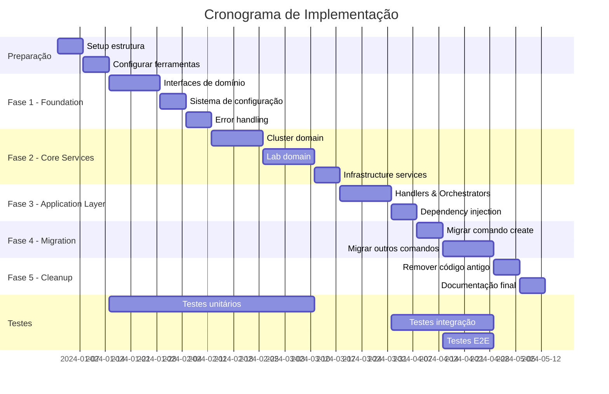

# 9. Plano de Implementação

## 🎯 Objetivo

Definir uma estratégia detalhada e incremental para implementar a nova arquitetura, minimizando riscos e mantendo a funcionalidade existente durante a transição.

## 📋 Visão Geral da Implementação

### 9.1 Estratégia de Migração

**Abordagem**: **Strangler Fig Pattern** - Substituir gradualmente o código antigo pelo novo, mantendo compatibilidade.



## 🚀 Fase 1: Foundation (3 semanas)

### 1.1 Setup da Estrutura (Semana 1)

**Objetivo**: Criar estrutura de pastas e configurar ferramentas.

**Tarefas**:

1. Criar nova estrutura de diretórios
2. Configurar ferramentas de desenvolvimento
3. Setup de geração de mocks
4. Configurar CI/CD para nova estrutura

**Entregáveis**:

```bash

# Comandos para executar
mkdir -p internal/{app,domain,infrastructure,adapters,pkg,tests}
mkdir -p internal/app/{handlers,orchestrators,dto}
mkdir -p internal/domain/{cluster,lab,repository,infrastructure,shared}
mkdir -p internal/infrastructure/{k8s,containerengine,http,filesystem,exec,ui}
mkdir -p internal/adapters/{config,logging,i18n,errors,telemetry}

# Configurar tools
go install github.com/golang/mock/mockgen@latest
go install github.com/golangci/golangci-lint/cmd/golangci-lint@latest

# Setup Makefile com novos targets

```

**Critérios de Aceitação**:

- [ ] Estrutura de pastas criada

- [ ] Tools configuradas e funcionando

- [ ] CI passando com nova estrutura

- [ ] Documentação de setup atualizada

### 1.2 Interfaces de Domínio (Semana 2)

**Objetivo**: Definir todas as interfaces de domínio.

**Código exemplo**:

```go

// internal/domain/cluster/service.go
type Service interface {
    Create(ctx context.Context, config *CreateConfig) (*Cluster, error)
    Delete(ctx context.Context, name string) error
    GetByName(ctx context.Context, name string) (*Cluster, error)
    List(ctx context.Context, filters *ListFilters) ([]*Cluster, error)
}

// internal/domain/cluster/repository.go
type Repository interface {
    Save(ctx context.Context, cluster *Cluster) error
    FindByName(ctx context.Context, name string) (*Cluster, error)
    Delete(ctx context.Context, name string) error
    List(ctx context.Context, filters *ListFilters) ([]*Cluster, error)
}

```

**Entregáveis**:

- [ ] Interfaces de todos os domínios

- [ ] Value objects básicos

- [ ] Entidades de domínio

- [ ] Tipos de erro estruturados

### 1.3 Sistema de Configuração (Semana 3)

**Objetivo**: Implementar novo sistema de configuração.

**Código exemplo**:

```go

// internal/adapters/config/loader.go
type Loader struct {
    sources []ConfigSource
    merger  *ConfigMerger
    validator *ConfigValidator
}

func (l *Loader) Load() (*Config, error) {
    // Implementação de carregamento hierárquico
}

```

**Entregáveis**:

- [ ] Config loader com múltiplas fontes

- [ ] Validação de configuração

- [ ] Defaults estruturados

- [ ] Testes de configuração

## 🏗️ Fase 2: Core Services (5 semanas)

### 2.1 Error Handling (Semana 4)

**Objetivo**: Sistema completo de tratamento de erros.

**Implementação**:

```go

// internal/adapters/errors/handler.go
type Handler struct {
    ui        ui.Service
    logger    logger.Logger
    i18n      i18n.Service
    recovery  RecoveryManager
}

func (h *Handler) Handle(err error) error {
    var girusErr *GirusError
    if !errors.As(err, &girusErr) {
        girusErr = h.wrapGenericError(err)
    }
    
    h.logError(girusErr)
    
    if girusErr.IsRecoverable() && h.recovery != nil {
        if recovered := h.attemptRecovery(girusErr); recovered {
            return nil
        }
    }
    
    h.displayError(girusErr)
    return girusErr
}

```

**Entregáveis**:

- [ ] Tipos de erro estruturados

- [ ] Error handler com recovery

- [ ] Factory functions para erros

- [ ] Localização de mensagens

- [ ] Testes de error handling

### 2.2 Cluster Domain (Semanas 5-6)

**Objetivo**: Implementar domínio de cluster completo.

**Implementação**:

```go

// internal/domain/cluster/entities.go
type Cluster struct {
    id          ClusterID
    name        string
    status      ClusterStatus
    nodes       []*Node
    metadata    *ClusterMetadata
    createdAt   time.Time
    updatedAt   time.Time
}

func NewCluster(name string, config *CreationConfig) (*Cluster, error) {
    if err := validateClusterName(name); err != nil {
        return nil, err
    }
    
    return &Cluster{
        id:        NewClusterID(),
        name:      name,
        status:    StatusCreating,
        createdAt: time.Now(),
        updatedAt: time.Now(),
    }, nil
}

// internal/services/cluster/kind_service.go
type KindService struct {
    containerEngine ContainerEngine
    k8sClient      KubernetesClient
    repository     Repository
    validator      Validator
    logger         logger.Logger
}

func (s *KindService) Create(ctx context.Context, config *CreateConfig) (*Cluster, error) {
    // Implementação da criação de cluster
}

```

**Entregáveis**:

- [ ] Entidades de cluster
- [ ] Regras de negócio
- [ ] Service implementation
- [ ] Repository implementation
- [ ] Testes unitários (>80% cobertura)

### 2.3 Lab Domain (Semanas 7-8)

**Objetivo**: Implementar domínio de laboratórios.

**Implementação**:

```go

// internal/domain/lab/entities.go
type Lab struct {
    id          LabID
    name        string
    version     string
    spec        *LabSpec
    status      LabStatus
    createdAt   time.Time
    updatedAt   time.Time
}

// internal/domain/lab/validation.go
type Validator struct {
    rules []ValidationRule
}

func (v *Validator) Validate(lab *Lab) (*ValidationResult, error) {
    // Implementação de validação
}

// internal/services/lab/configmap_service.go
type ConfigMapService struct {
    k8sClient KubernetesClient
    validator Validator
    repository Repository
}

```

**Entregáveis**:

- [ ] Entidades de lab
- [ ] Sistema de validação
- [ ] Service implementation
- [ ] Repository implementation
- [ ] Testes unitários

### 2.4 Infrastructure Services (Semana 9)

**Objetivo**: Implementar serviços de infraestrutura.

**Implementação**:

```go

// internal/infrastructure/containerengine/docker/client.go
type DockerClient struct {
    executor exec.CommandExecutor
    logger   logger.Logger
}

func (c *DockerClient) IsAvailable(ctx context.Context) error {
    return c.executor.Run(ctx, "docker", "--version")
}

// internal/infrastructure/k8s/client.go
type Client struct {
    clientset kubernetes.Interface
    config    *rest.Config
    logger    logger.Logger
}

```

**Entregáveis**:

- [ ] Container engine abstractions

- [ ] Kubernetes client wrapper

- [ ] Command executor

- [ ] HTTP client com retry

- [ ] Filesystem operations

## 🎯 Fase 3: Application Layer (3 semanas)

### 3.1 Handlers & Orchestrators (Semanas 10-11)

**Objetivo**: Implementar camada de aplicação.

**Implementação**:

```go

// internal/app/handlers/cluster/create_handler.go
type CreateHandler struct {
    orchestrator *orchestrators.ClusterOrchestrator
    validator    *validation.Validator
    logger       logger.Logger
}

func (h *CreateHandler) Handle(ctx context.Context, req *dto.CreateClusterRequest) (*dto.CreateClusterResponse, error) {
    if err := h.validator.ValidateStruct(req); err != nil {
        return nil, errors.NewValidationError("invalid request", err)
    }
    
    domainReq := h.toDomainRequest(req)
    result, err := h.orchestrator.CreateCluster(ctx, domainReq)
    if err != nil {
        return nil, err
    }
    
    return h.toResponse(result), nil
}

// internal/app/orchestrators/cluster_orchestrator.go
type ClusterOrchestrator struct {
    clusterSvc      cluster.Service
    prerequisiteSvc infrastructure.Service
    uiSvc           ui.Service
    errorHandler    *errors.Handler
}

func (o *ClusterOrchestrator) CreateCluster(ctx context.Context, req *CreateClusterRequest) (*ClusterResult, error) {
    // Implementação do workflow completo
}

```

**Entregáveis**:

- [ ] Handlers para todos os comandos

- [ ] Orchestrators para workflows

- [ ] DTOs para transferência de dados

- [ ] Testes de integração

### 3.2 Dependency Injection (Semana 12)

**Objetivo**: Sistema de injeção de dependência.

**Implementação**:

```go

// internal/app/container.go
type Container struct {
    config *config.Config
    
    // Services
    clusterSvc      cluster.Service
    labSvc          lab.Service
    infrastructureSvc infrastructure.Service
    
    // Orchestrators
    clusterOrch     *orchestrators.ClusterOrchestrator
    labOrch         *orchestrators.LabOrchestrator
    
    // Handlers
    createClusterHandler *handlers.CreateClusterHandler
}

func NewContainer(config *config.Config) (*Container, error) {
    container := &Container{config: config}
    
    if err := container.initializeServices(); err != nil {
        return nil, err
    }
    
    return container, nil
}

```

**Entregáveis**:

- [ ] Container de dependências
- [ ] Factory methods
- [ ] Configuration injection
- [ ] Interface compliance tests

## 🔄 Fase 4: Migration (3 semanas)

### 4.1 Migrar Comando Create (Semana 13)

**Objetivo**: Migrar comando create para nova arquitetura.

**Antes**:

```go

// cmd/create.go (500+ linhas)
var createClusterCmd = &cobra.Command{
    Use: "cluster",
    Run: func(cmd *cobra.Command, args []string) {
        // 500+ linhas de lógica misturada
    },
}

```

**Depois**:

```go

// cmd/create.go (10-20 linhas)
var createClusterCmd = &cobra.Command{
    Use: "cluster",
    RunE: func(cmd *cobra.Command, args []string) error {
        req := buildCreateClusterRequest(cmd)
        handler := app.Container.GetCreateClusterHandler()
        return handler.Handle(cmd.Context(), req)
    },
}

```

**Estratégia de Migração**:

1. Criar novo comando `create-v2`
2. Implementar e testar nova funcionalidade
3. Fazer feature flag para alternar entre versões
4. Migrar gradualmente funcionalidades
5. Remover código antigo

**Entregáveis**:

- [ ] Comando create refatorado
- [ ] Testes de regressão passando
- [ ] Performance equivalente ou melhor
- [ ] Funcionalidade preservada

### 4.2 Migrar Outros Comandos (Semanas 14-15)

**Objetivo**: Migrar todos os outros comandos.

**Comandos a migrar**:

- [ ] `girus delete`
- [ ] `girus list`
- [ ] `girus status`
- [ ] `girus lab`
- [ ] `girus repo`

**Estratégia**:

1. Aplicar mesmo padrão usado no `create`
2. Reutilizar handlers e services
3. Manter compatibilidade de CLI
4. Testes abrangentes

## 🧹 Fase 5: Cleanup (2 semanas)

### 5.1 Remover Código Antigo (Semana 16)

**Objetivo**: Limpar código legacy e otimizar.

**Tarefas**:

- [ ] Remover arquivos não utilizados
- [ ] Limpar imports desnecessários
- [ ] Otimizar performance
- [ ] Revisar e melhorar logs
- [ ] Atualizar dependências

### 5.2 Documentação Final (Semana 17)

**Objetivo**: Documentação completa da nova arquitetura.

**Entregáveis**:

- [ ] Documentação de arquitetura atualizada
- [ ] Guias de desenvolvimento
- [ ] Exemplos de uso
- [ ] Troubleshooting guide
- [ ] Release notes

## 📊 Critérios de Sucesso

### 9.2 Métricas de Qualidade

| Métrica | Meta | Como Medir |
|---------|------|------------|
| **Cobertura de Testes** | > 80% | `go test -cover` |
| **Complexidade Ciclomática** | < 5 por função | `gocyclo` |
| **Duplicação de Código** | < 5% | `goclone` |
| **Performance** | Sem degradação | Benchmarks |
| **Memory Usage** | < 50MB | Profiling |
| **Startup Time** | < 100ms | Time measurement |

### 9.3 Testes de Aceitação

**Testes Funcionais**:

```bash

# Cluster operations
girus create cluster --name test
girus status cluster test
girus delete cluster test

# Lab operations
girus create lab kubernetes-basics
girus list labs
girus delete lab kubernetes-basics

# Repository operations
girus repo add custom-repo https://example.com/index.yaml
girus repo list
girus list repo-labs

```

**Testes de Performance**:

```bash

# Benchmark cluster creation
time girus create cluster --name benchmark-test

# Memory usage test
valgrind girus create cluster --name memory-test

# Concurrent operations
parallel 'girus create cluster --name test-{}' ::: {1..5}

```

## 🔧 Ferramentas e Automação

### 9.4 Scripts de Migração

```bash

#!/bin/bash
# scripts/migrate-phase.sh

phase=$1
case $phase in
  "1")
    echo "Executando Fase 1: Foundation"
    ./scripts/setup-structure.sh
    ./scripts/generate-interfaces.sh
    ;;
  "2")
    echo "Executando Fase 2: Core Services"
    ./scripts/implement-domains.sh
    ./scripts/run-tests.sh
    ;;
  "3")
    echo "Executando Fase 3: Application Layer"
    ./scripts/create-handlers.sh
    ./scripts/setup-di.sh
    ;;
  *)
    echo "Fase não reconhecida: $phase"
    exit 1
    ;;
esac

```

### 9.5 Validação Contínua

```yaml

# .github/workflows/migration-validation.yml
name: Migration Validation

on: [push, pull_request]

jobs:
  test-old-vs-new:
    runs-on: ubuntu-latest
    steps:
      - name: Test Old Implementation
        run: |
          git checkout HEAD~1
          go test ./cmd/...
          
      - name: Test New Implementation
        run: |
          git checkout HEAD
          go test ./internal/...
          
      - name: Compare Performance
        run: ./scripts/compare-performance.sh

```

## 🎯 Riscos e Mitigações

### 9.6 Principais Riscos

| Risco | Probabilidade | Impacto | Mitigação |
|-------|--------------|---------|-----------|
| **Breaking Changes** | Média | Alto | Feature flags, backward compatibility |
| **Performance Degradation** | Baixa | Alto | Benchmarks contínuos, profiling |
| **Bugs em Produção** | Média | Alto | Testes extensivos, rollback plan |
| **Atraso no Cronograma** | Alta | Médio | Buffer time, priorização |
| **Resistência da Equipe** | Baixa | Médio | Treinamento, documentação |

### 9.7 Plano de Contingência

**Se ocorrer problema crítico**:

1. **Rollback Imediato**: Reverter para versão anterior
2. **Análise de Root Cause**: Identificar causa do problema
3. **Fix Forward**: Corrigir na nova arquitetura
4. **Testes Adicionais**: Validar correção
5. **Deploy Gradual**: Rollout controlado

## 📈 Benefícios Esperados

### 9.8 Melhorias Quantificáveis

| Aspecto | Antes | Depois | Melhoria |
|---------|-------|--------|----------|
| **Linhas de código por função** | 500+ | <50 | 90% redução |
| **Tempo para adicionar feature** | 2-3 dias | 2-4 horas | 85% redução |
| **Cobertura de testes** | 0% | >80% | ∞ melhoria |
| **Tempo de debug** | 1-2 horas | 10-20 min | 80% redução |
| **Complexidade ciclomática** | 25+ | <5 | 80% redução |

### 9.9 ROI Esperado

**Investimento**:

- 17 semanas de desenvolvimento
- ~340 horas de trabalho

**Retorno**:

- Redução de 80% no tempo de manutenção
- Redução de 85% no tempo para novas features
- Redução de 90% em bugs relacionados à complexidade
- Melhoria na satisfação do desenvolvedor

## 🎉 Conclusão

Este plano de implementação fornece uma roadmap clara e detalhada para transformar o GIRUS CLI de uma arquitetura monolítica para uma arquitetura limpa e modular. A abordagem incremental minimiza riscos enquanto maximiza os benefícios de qualidade, manutenibilidade e extensibilidade.

A implementação bem-sucedida resultará em:

- **Código mais limpo e organizando**
- **Testes abrangentes e confiáveis**
- **Desenvolvimento mais rápido e seguro**
- **Facilidade para adicionar novas funcionalidades**
- **Melhor experiência para desenvolvedores e usuários**
